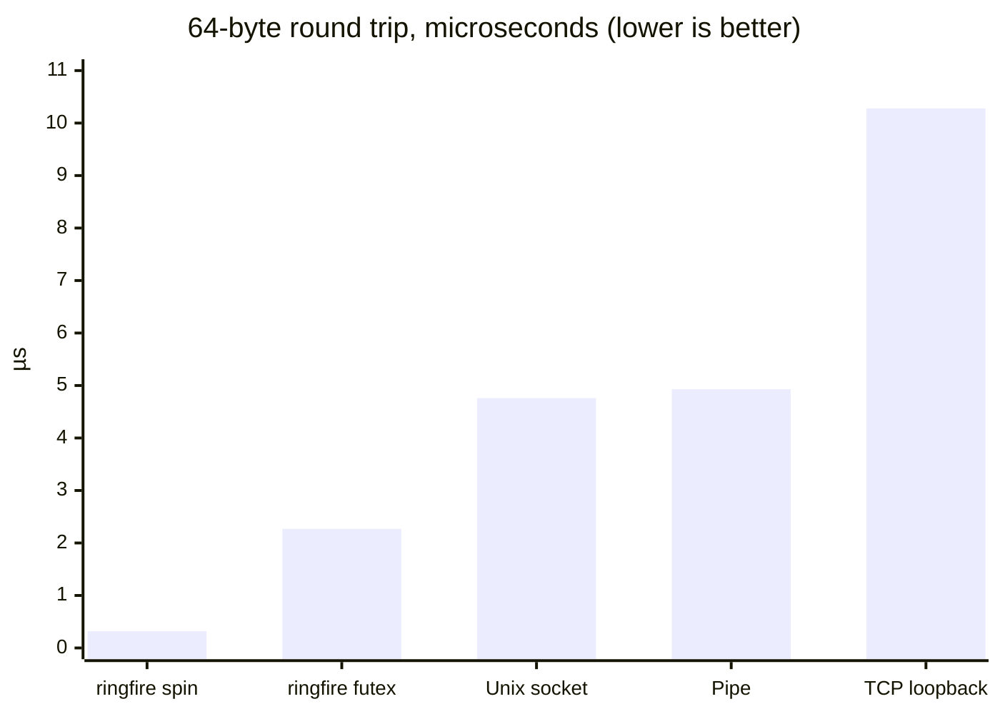

# ringfire 🔥

[](https://crates.io/crates/ringfire)
[](https://docs.rs/ringfire)
[](https://github.com/alex09x/ringfire/actions/workflows/ci.yml)
[](LICENSE-MIT)
[](https://www.rust-lang.org)

**`ringfire`** is an ultra-low-latency, zero-copy, lock-free **Inter-Process Communication (IPC)** ring buffer and shared memory state bus for Linux.

It is engineered for high-frequency trading (HFT) engines, real-time market data ingestion, telemetry buses, and performance-critical distributed pipelines where microsecond socket latencies and kernel overhead are unacceptable.

## ⚡ Performance at a Glance

**Round trip of a 64-byte message between two threads**, same machine, same harness
(`cargo bench --bench ipc_compare`, AMD Ryzen 9 7950X, Linux 6.8, v0.4.0):

| Transport | Round trip | vs. ringfire (spin) |
| :--- | ---: | ---: |
| **ringfire**, busy-spin readers | **0.32 µs** | 1× |
| **ringfire**, `FutexWait` (sleeps in the kernel when idle) | **2.27 µs** | 7× |
| Unix domain socket | 4.76 µs | 15× |
| Pipe | 4.93 µs | 15× |
| TCP loopback (`TCP_NODELAY`) | 10.28 µs | 32× |



**Hot-path costs** (`cargo bench --bench throughput`, 64-byte messages):

| Operation | Time | Rate |
| :--- | ---: | ---: |
| `push` (no reader attached) | 1.88 ns | 533 M msg/s |
| `try_recv` | 6.4 ns | 156 M msg/s |
| `recv_batch(32)` | 2.3 ns / msg | 431 M msg/s |
| `push` with a reader draining on another core | 41 ns | 24 M msg/s |
| Blackboard read / write (O(1) seqlock) | 2.1 / 1.1 ns | — |

The last `push` row is the realistic cross-process figure: it is bound by moving cache lines
between cores, and costs the same with lossless backpressure enabled (+0.8 ns). Every read is
validated against concurrent overwrites; the regression suite verifies zero torn records under
continuous lapping on x86-64 and AArch64. Full numbers: [Detailed Benchmarks](#-detailed-benchmarks-amd-ryzen-9-7950x-on-linux-booster).

---

## 💡 The Problem: Why Traditional IPC Fails Under High Load

When communicating between processes on the same host, developers usually default to Unix Domain Sockets (UDS), TCP loopback, pipes, ZeroMQ, or broker-based message queues (NATS, Redis). In high-throughput, low-latency environments, these primitives introduce severe architectural bottlenecks:

| IPC Mechanism | Kernel Overhead | Memory Copies | One-way Latency | Backpressure / Crash Behavior |
| :--- | :--- | :--- | :--- | :--- |
| **Unix Domain Sockets (UDS)** | 2 syscalls (`send`/`recv`) + context switch | User $\to$ Kernel $\to$ User (2 copies) | ~2,400 ns measured (RTT / 2) | Socket buffer fills up; blocks producer or drops packets |
| **TCP Loopback (`127.0.0.1`)** | Full TCP/IP stack + packetization | Multiple copies + TCP buffers | ~5,100 ns measured (RTT / 2) | Heavy CPU jitter, flow control stalls |
| **Pipes / FIFOs** | Pipe inode lock + syscalls | Buffer copy through VFS | ~2,500 ns measured (RTT / 2) | Blocking write when pipe buffer (64 KB) fills |
| **Message Brokers (Redis / NATS)** | Network stack + daemon context switch | Multi-hop serialization | 50,000 – 500,000 ns (typical, not measured) | High GC/memory pressure, single point of failure |
| **`ringfire` (Shared Memory)** | **0 syscalls on hot path** | **1 copy (payload into the slot)** | **~160 ns one-way (measured)** | **Writer never blocks (lossy) or throttles on the slowest reader (lossless); crash-isolated** |

### The Three Critical Pain Points:
1. **The Syscall & Context Switch Tax**: Every `write()` and `read()` triggers CPU privilege elevation from user-space to kernel-space and back, polluting CPU L1/L2 caches and branch predictors.
2. **Buffer Bloat & Head-of-Line Blocking**: If a consumer process stalls (e.g. garbage collection pause in Python, disk IO hiccup, or debug pause), standard socket buffers fill up immediately, stalling the critical producer or blowing up memory.
3. **Serialization Overhead**: Marshalling data to and from JSON, Protobuf, or even compact binary encoders consumes valuable CPU cycles and allocates memory on the hot path.

---

## 🎯 The Solution & Vision: What `ringfire` Solves

`ringfire` moves the communication fabric directly into physical RAM via POSIX shared memory (`/dev/shm`):

- **Pure Shared Memory (`/dev/shm`)**: Producer and consumers map the exact same physical memory region directly into their virtual address spaces.
- **Atomic Acquire/Release Synchronization**: State is coordinated via 64-bit atomic sequence numbers using CPU-level memory barriers (`core::sync::atomic`), completely bypassing the operating system kernel.
- **Single-Writer Freedom (`LatestWins` Policy)**: The producer always writes to the ring. Slow, paused, or dead consumers can never block, stall, or crash the producer. If a consumer falls behind the ring buffer capacity, it detects that it was lapped and skips cleanly to the live stream.
- **Cache-Line Isolated Layout**: Memory structures are aligned to 128-byte cache lines to eliminate false sharing between producer write heads and consumer read heads.
- **O(1) State Blackboard**: Besides sequential stream events, `ringfire` provides a direct seqlock-synchronized slot table. Consumers can instantly inspect the latest state (e.g., current Best Bid & Offer for 500 coins) in ~2 nanoseconds without replaying historical events.
- **Polyglot First-Class Support**: Because the layout in `/dev/shm` is standard C-ABI memory, consumers can be written in Rust, C, C++, or Python (`mmap` + `ctypes`/`numpy`) with zero bridge penalty.

---

## 🤝 The Rapidfire Family

`ringfire` is designed as the cross-process counterpart to [**`rapidfire`**](https://github.com/alex09x/rapidfire):

```text
┌─────────────────────────────────────────────────────────────────────────────┐
│                          IN-PROCESS (Single Process)                        │
│                                                                             │
│                                  rapidfire                                  │
│           • Intra-process MPMC / MPSC channels across threads & Tokio       │
│           • Ultra-low latency (< 15 ns), zero heap allocations              │
└──────────────────────────────────────┬──────────────────────────────────────┘
                                       │
                                       ▼
┌─────────────────────────────────────────────────────────────────────────────┐
│                         CROSS-PROCESS (Multi-Process IPC)                   │
│                                                                             │
│                                  ringfire                                   │
│           • Inter-process lock-free ring buffer via /dev/shm                │
│           • O(1) Shared State Blackboard (Seqlock)                          │
│           • ~160 ns cross-core latency, C11 header, Python bindings         │
└─────────────────────────────────────────────────────────────────────────────┘
```

---

## 🚀 Detailed Benchmarks (AMD Ryzen 9 7950X on Linux `booster`)

Benchmarked using Criterion directly against POSIX shared memory (`/dev/shm`) on host `booster` (16 Cores / 32 Threads, Linux 6.8):

Measured with protocol v2 (v0.4.0), 64-byte messages:

| Metric | Measured Value | Rate / Notes |
| :--- | :--- | :--- |
| **SPMC Single-Message Push** (no reader) | **1.88 ns** | 533 Million msgs / sec |
| **SPMC Non-Blocking `try_recv`** | **6.41 ns** | 156 Million msgs / sec |
| **SPMC Batch Drain (`recv_batch(32)`)** | **74.2 ns** (2.3 ns / msg) | 431 Million msgs / sec |
| **Push with a reader draining on another core** | **41.2 ns** lossy / **42.0 ns** lossless | Cross-core cache-line transfer; the lossless gate adds < 1 ns |
| **Roundtrip Latency (Ping-Pong RTT)** | **249.6 ns** | ~125 ns one-way cross-thread IPC |
| **Blackboard Seqlock Read (O(1))** | **2.13 ns** | Tear-free snapshot read |
| **Blackboard Seqlock Write (O(1))** | **1.13 ns** | Seqlock update |
| **Multi-Process Saturation** | **1 writer + 8 readers** | Zero gaps / zero corruption |

Single-threaded figures measure the instruction path with a warm cache; real cross-process
throughput is bounded by the cross-core transfer shown in the "with a reader" row.
`tests/regression_tests.rs` checks that no torn record is ever returned under continuous lapping.

---

## 📦 Quickstart (Rust)

All snippets below are compiled and run in CI as [`examples/quickstart.rs`](examples/quickstart.rs) (`cargo run --example quickstart`).

### 1. Producer: Publish Fixed-Size Binary Records

```rust
use ringfire::RingProducer;

#[repr(C)]
#[derive(Clone, Copy, Debug, PartialEq, Eq)]
struct MarketTicker {
    asset_id: u32,
    bid_px: u64,
    ask_px: u64,
    timestamp_ns: u64,
}

fn main() -> Result<(), Box<dyn std::error::Error>> {
    // Creates a 65,536 slot ring buffer in /dev/shm/hft_ticker_stream
    let mut producer = RingProducer::<MarketTicker>::create("/dev/shm/hft_ticker_stream", 65536)?;

    let ticker = MarketTicker {
        asset_id: 42,
        bid_px: 64_250_000_000,
        ask_px: 64_250_500_000,
        timestamp_ns: 1_726_870_000_000_000,
    };

    // Pushes ticker directly to shared memory (~2 ns)
    producer.push(&ticker);

    Ok(())
}
```

### 2. Tokio Async Consumer: Cooperative Non-Blocking Streaming

In async bots, busy loops starve the Tokio runtime. `AsyncRingConsumer` solves this with adaptive fast-path spinning, cooperative `tokio::task::yield_now()`, and 0% CPU idle sleep:

```rust
use ringfire::AsyncRingConsumer;

#[tokio::main]
async fn main() -> Result<(), Box<dyn std::error::Error>> {
    let mut consumer = AsyncRingConsumer::<MarketTicker>::attach("/dev/shm/hft_ticker_stream")?;

    println!("Attached async consumer. Streaming market data...");

    loop {
        // Yields cooperatively to other Tokio tasks when no traffic is present
        let ticker = consumer.recv().await;
        // Process ticker without stalling the Tokio runtime
    }
}
```

### 3. Synchronous Low-Latency Consumer (Dedicated Cores)

```rust
use ringfire::{RingConsumer, BusySpin};

let mut consumer = RingConsumer::<MarketTicker>::attach("/dev/shm/hft_ticker_stream")?;
let mut wait = BusySpin::new();

loop {
    // Spin polling for sub-20ns reaction time
    let ticker = consumer.recv_blocking(&mut wait);
    // Process ticker
}
```

### 4. Shared State Blackboard (O(1) Snapshot Table)

```rust
use ringfire::{BlackboardProducer, BlackboardConsumer};

// Producer updates snapshot table
let mut bb_prod = BlackboardProducer::<MarketTicker>::create("/dev/shm/hft_state_table", 1024)?;
bb_prod.write(42, &ticker)?; // ~1.1 ns write

// Consumer reads instantaneous current state by asset ID
let bb_cons = BlackboardConsumer::<MarketTicker>::attach("/dev/shm/hft_state_table")?;
if let Some(state) = bb_cons.read(42)? { // ~2.1 ns O(1) tear-free read
    println!("Current BBO for asset 42: bid={}, ask={}", state.bid_px, state.ask_px);
}
```

### 5. Raw Binary Payloads (`[u8; N]`) & Pointer Casting

You can also operate over raw byte buffers without declaring fixed structs:

```rust
use ringfire::{RingProducer, AsyncRingConsumer};

// Producer sends a raw 64-byte binary packet
let mut producer = RingProducer::<[u8; 64]>::create("/dev/shm/raw_stream", 65536)?;
let raw_bytes = [0xAAu8; 64];
producer.push(&raw_bytes);

// Consumer reads the 64 bytes and decodes the struct (byte arrays are not aligned for it)
let mut consumer = AsyncRingConsumer::<[u8; 64]>::attach("/dev/shm/raw_stream")?;
let bytes: [u8; 64] = consumer.recv().await;
let ticker: MarketTicker = unsafe { std::ptr::read_unaligned(bytes.as_ptr().cast()) };
```

### 6. Variable-Length Payloads (`BlobProducer` & `BlobConsumer`)

For variable-sized messages (e.g. L2/L3 order book snapshots, compressed frames, or variable trade batches), `ringfire` pairs fixed ring descriptors with a contiguous shared-memory `PayloadArena`:

```rust
use ringfire::{BlobProducerBuilder, BlobConsumer};

// Create a ring with 65,536 descriptor slots and a 16 MB byte arena
let mut producer = BlobProducerBuilder::new(65536, 16 * 1024 * 1024)
    .build::<u32, _>("/dev/shm/orderbook_stream")?;

// Push variable-length JSON, protobuf, or raw bytes directly into the arena
let raw_json = br#"{"event":"snapshot","bids":[[82000.5,1.2]],"asks":[[82001.0,0.8]]}"#;
producer.push(&42, raw_json)?;

// Consumer copies metadata + payload out of the arena, validated against overwrites
let mut consumer = BlobConsumer::<u32>::attach("/dev/shm/orderbook_stream")?;
let mut meta = 0u32;
let mut scratch_buffer = vec![0u8; 4096];
if let Some(len) = consumer.recv(&mut meta, &mut scratch_buffer)? {
    println!("Received {} byte snapshot for symbol {}", len, meta);
}

// Or inspect in place: the closure's result is discarded if the arena laps during it
let summary = consumer.view(|symbol, bytes| (*symbol, bytes.len()))?;
```

If the arena wraps around before a consumer gets to a message (payloads larger than
`arena_capacity / ring capacity` on average), that message is skipped and counted in
`lapped_count()`; size the arena for the backlog you need to retain.

### 7. Consumer Start Modes & Lock-Free SHM Checkpointing

Consumers can configure where in the stream to begin reading, and persist their read cursors lock-free into `/dev/shm` (a single atomic store plus a timestamp):

```rust
use ringfire::{RingConsumerBuilder, ConsumerStartMode};

let mut consumer = RingConsumerBuilder::<MarketTicker>::new()
    // Modes: Latest (instant jump), Head (wait for future), Oldest (replay backlog), Sequence(N)
    .start_mode(ConsumerStartMode::Latest)
    .attach("/dev/shm/hft_ticker_stream")?;

// Or attach with persistent offset checkpoint in /dev/shm:
let mut persistent_consumer = RingConsumerBuilder::<MarketTicker>::new()
    .offset_file("/dev/shm/hft_ticker_stream_worker1.offset")
    .attach("/dev/shm/hft_ticker_stream")?;

// In consumer loop, periodically or per-batch commit offset:
persistent_consumer.commit_offset()?;
```

### 8. Lossless Backpressure Flow Control

While default `ringfire` channels operate in `LatestWins` lossy mode (writer never blocks), streaming pipelines requiring zero message drops can enable `LosslessBackpressure`:

```rust
use ringfire::{RingProducerBuilder, FlowControl, RingfireError};

let mut producer = RingProducerBuilder::new(4096)
    .flow_control(FlowControl::LosslessBackpressure)
    .build::<MarketTicker, _>("/dev/shm/reliable_stream")?;

// Writer throttles (via spin/yield backoff) if slowest registered reader is about to be lapped:
producer.push(&ticker);

// Or use non-blocking try_push:
match producer.try_push(&ticker) {
    Ok(()) => println!("Pushed successfully"),
    Err(RingfireError::BackpressureBufferFull) => println!("Slow reader lag detected, backpressure applied"),
    Err(e) => return Err(e.into()),
}
```

What the guarantee covers:
- Only **Rust `RingConsumer`s registered in the ring's reader registry** hold the producer back
  (default 32 slots, `RingProducerBuilder::max_readers`). On a lossless ring, attaching when
  the registry is full fails with `NoAvailableReaderSlots`. Python and C readers do not
  register and can be lapped.
- A reader is protected from the moment the producer observes its registration (the
  producer rescans at least every half ring); a reader starting from `Oldest` on a busy
  ring can still find its first messages gone and reports them via `lapped_count()`.
- Reader liveness is checked by PID. Readers in another PID namespace (a different
  container) look dead to the producer and are dropped from the registry: share the PID
  namespace when using lossless mode across containers.
- The producer checks the registry only when it approaches the slowest cached cursor, so
  the lossless hot path has no syscalls and costs under 1 ns over lossy mode.

### 9. Multi-Channel Multiplexing (`RingMultiplexer` & `AsyncRingMultiplexer`)

Multiplex across multiple distinct ring buffer streams with fair Round-Robin or strict Priority scheduling:

```rust
use ringfire::{RingConsumer, RingMultiplexer};

let c1 = RingConsumer::<MarketTicker>::attach("/dev/shm/stream_btc")?;
let c2 = RingConsumer::<MarketTicker>::attach("/dev/shm/stream_eth")?;

let mut mux = RingMultiplexer::new();
mux.add(c1);
mux.add(c2);

// Fair Round-Robin across all channels
if let Some((channel_idx, ticker)) = mux.try_recv_any() {
    println!("Channel {} received ticker {}", channel_idx, ticker.asset_id);
}

// Or Tokio async multiplexing:
// let (idx, ticker) = async_mux.recv_any().await;
```

### 10. CLI Diagnostic & Monitoring Tool (`ringfire`)

The bundled `ringfire` binary provides real-time terminal monitoring and inspection:

```bash
# View buffer configuration, sequence counters, and registered consumer lag
cargo run --bin ringfire -- stat /dev/shm/hft_ticker_stream

# Machine-readable JSON output for automated telemetry:
cargo run --bin ringfire -- stat /dev/shm/hft_ticker_stream --json

# Real-time interactive terminal dashboard with msg/s and MB/s throughput:
cargo run --bin ringfire -- top /dev/shm/hft_ticker_stream --interval-ms 500

# Dump recent slots and payloads in hex or ASCII:
cargo run --bin ringfire -- dump /dev/shm/hft_ticker_stream --tail 10 --hex

# Clean up dead reader slots from crashed processes:
cargo run --bin ringfire -- prune /dev/shm/hft_ticker_stream
```

---

### 11. Network Mirrors: One Source Ring, Identical Copies on Other Hosts

`ringfire serve` streams a ring to any number of mirror hosts; `ringfire mirror` keeps a
ring with the **same geometry and the same sequence numbers** in the local `/dev/shm`.
Readers on a mirror host attach to that ring exactly as they would on the source host and
never touch the network. Records travel as raw slot payloads, so one server/mirror pair
works for any element type without recompiling.

```bash
# Source host: publish /dev/shm/ticks to mirrors (one thread and one ring reader per mirror)
ringfire serve /dev/shm/ticks --bind 0.0.0.0:7400 --spin

# Each mirror host: keep an identical /dev/shm/ticks; reconnects and resumes on its own
ringfire mirror source-host:7400 /dev/shm/ticks --from latest --spin
```

```rust
use ringfire::{Mirror, MirrorStart, ReplicaServer, RingConsumer};

// Source host
let server = ReplicaServer::bind("/dev/shm/ticks", "0.0.0.0:7400")?.spin(true);
server.spawn()?;

// Mirror host
let mut mirror = Mirror::builder()
    .start(MirrorStart::Oldest)
    .spin(true)
    .connect("source-host:7400", "/dev/shm/ticks")?;
std::thread::spawn(move || mirror.run());
let mut reader = RingConsumer::<Tick>::attach("/dev/shm/ticks")?; // same code as on the source host
```

* **Ordered and gap-free while the link keeps up.** Every record carries the source's
  sequence number; a mirror never reorders or duplicates. If the server-side reader is
  lapped by the source ring (a stalled link, a mirror that stopped reading) it
  resynchronizes at the oldest retained message and the mirror receives a `GAP`, which is
  exactly what a slow reader on the source host would observe.
* **Resume after a restart.** `--from resume` continues after the last sequence in the
  existing mirror ring; the source ring itself is the retransmission buffer, so everything
  it still retains is recovered. A source that restarted its numbering makes the mirror
  start over.
* **Mirror rings are broadcast rings** (`FLAG_MODE_SPMC | FLAG_POLICY_LATEST_WINS |
  FLAG_SPARSE`): the mirror writer never waits for local readers. `FLAG_SPARSE` marks
  rings whose sequence numbers may have holes; a Rust `RingConsumer` then skips to the
  next message present instead of waiting for a sequence that will never arrive.
* **Own binary protocol**: a 16-byte frame header, up to 65,535 records per `DATA`
  frame, `HEARTBEAT` while idle. The frame table is in `src/replication.rs`.
* **Fixed-size and variable-length records.** A `RingProducer` ring is copied slot for
  slot. A `BlobProducer` ring (descriptor ring plus payload arena) is copied record for
  record: each blob keeps its bytes, length, flags and sequence and lands in the mirror's
  own arena, which no reader can tell apart. A blob whose bytes the source already
  overwrote is skipped with a `GAP`, exactly as a lapped local `BlobConsumer` would skip
  it. Blobs larger than one datagram ride IP fragmentation; blobs larger than the host's
  datagram limit reach mirrors through the `NAK` path over TCP.
* **UDP multicast** (`--multicast GROUP:PORT`): the source sends each `DATA` frame once,
  as one datagram, and every mirror receives it, so the cost does not grow with the number
  of mirrors. The TCP connection stays for the handshake and for retransmission: a mirror
  that sees a sequence jump sends `NAK` and gets the range back from the source ring (or
  `GAP` for what is no longer retained). Datagrams that overtake a hole are held back, so
  the mirror ring is still written strictly in order. A lost *last* datagram is caught by
  the 1 ms multicast heartbeat.
* **UDP unicast for routes without multicast** (`serve --udp PORT`, `mirror --unicast`):
  the source sends the same datagrams to each mirror that asked for them, from one fixed
  port; mirrors punch to it first, so it works from behind NAT. `--dup N` sends every
  datagram N times and mirrors drop the copies by sequence: on a lossy long-haul link a
  single loss then costs no round trip. A mirror is an ordinary ring, so a site can run
  one mirror over the WAN and serve it again locally by multicast or unicast: one copy
  crosses the ocean, however many readers the site has.
* `cargo run --release --example replication_latency` measures one-way source ring →
  mirror ring latency and burst throughput over loopback;
  `examples/replication_pingpong.rs` measures a round trip between two hosts;
  `examples/replication_stages.rs` measures every stage on every host at once.

```bash
# Source host: live records by multicast, TCP only for handshakes and NAKs
ringfire serve /dev/shm/ticks --bind 0.0.0.0:7400 --multicast 239.255.0.1:7401 --iface 10.0.0.5 --spin

# Each mirror host (join on the NIC facing the source)
ringfire mirror 10.0.0.5:7400 /dev/shm/ticks --iface 10.0.0.7 --spin
```

Measured with 64-byte slots, one message every 100 µs, producer, server, mirror and reader
all busy-polling (`--spin`), Linux 6.8, kernel network stack:

| Path | Transport | p50 | p99 | max |
| :--- | :--- | ---: | ---: | ---: |
| Loopback, source ring → mirror ring, one way (Ryzen 9 7950X) | TCP | 6.0 µs | 6.8 µs | 19.7 µs |
| Loopback, source ring → mirror ring, one way (Ryzen 9 7950X) | multicast | 3.3 µs | 8.2 µs | 66.8 µs |
| Two Ryzen 9 7950X hosts on a 1 GbE LAN, round trip: two network hops, four ring hand-offs | TCP | 54.0 µs | 59.1 µs | 1.3 ms |
| Two Ryzen 9 7950X hosts on a 1 GbE LAN, round trip: two network hops, four ring hand-offs | multicast | 53.1 µs | 59.9 µs | 86.9 µs |

Half a LAN round trip is about 27 µs one way whichever transport is used: that is the two
kernel network stacks, the ring hand-offs on each side add well under a microsecond.
Multicast buys the tail (a worst case of 87 µs instead of 1.3 ms over 20,000 samples).

The same round trip with **16 more mirrors** of the source ring on the second host (the
source runs on 16 cores, the extra mirrors poll without spinning), verified afterwards to
hold all 22,000 records each:

| Extra mirrors | Transport | p50 | p90 | p99 | max |
| ---: | :--- | ---: | ---: | ---: | ---: |
| 0 | TCP | 54.4 µs | 56.1 µs | 60.3 µs | 82 µs |
| 16 | TCP | 53.5 µs | 102.2 µs | 235.1 µs | 11.0 ms |
| 0 | multicast | 52.5 µs | 53.9 µs | 58.5 µs | 68 µs |
| 16 | multicast | 63.7 µs | 66.2 µs | 72.1 µs | 84 µs |

With TCP the source pays one thread and one `write` per mirror per message, and two of
the sixteen TCP mirrors were still behind when the run ended; with multicast it pays one
`sendto` however many mirrors listen. Run-to-run variation on these shared hosts is about
±10 µs at p50.

**Sustained rate** (`examples/replication_stress.rs`: open loop, the pinger publishes at
a fixed rate for 5 s and never waits, the other host echoes everything, echoes are matched
by sequence; 64-byte slots, same two hosts):

| Rate | Transport, frame linger | Delivered | RTT p50 | RTT p99 |
| ---: | :--- | ---: | ---: | ---: |
| 10,000/s | multicast, none | 100 % | 54 µs | 62 µs |
| 20,000/s | multicast, none | 100 % | 51 µs | 65 µs |
| 50,000/s | multicast, none | 100 % | 830 µs | 1.5 ms |
| 50,000/s | multicast, 100 µs | 100 % | 213 µs | 268 µs |
| 100,000/s | multicast, 100 µs | 100 % | 221 µs | 272 µs |
| 500,000/s | multicast, 100 µs | 100 % | 122 µs | 3.5 ms |
| 1,000,000/s | multicast, 300 µs | 100 % | 0.93 ms | 1.8 ms |
| 100,000/s | TCP, adaptive | 100 % | 1.2 ms | 4.0 ms |

**Per stage, on every host at once** (`examples/replication_stages.rs`: the master stamps
each record when it pushes it; a consumer on the master and one on each of eight slaves,
six on a second host and two on the master's own host, stamp the read; slave clocks are
translated into the master's with a PTP-style offset from the minimum-round-trip probe,
so cross-host figures carry a systematic uncertainty of a few microseconds):

| Stage, 1,000 msg/s, multicast | p50 | p99 | max |
| :--- | ---: | ---: | ---: |
| push → read by a consumer on the master (same ring) | 0.1 µs | 0.1 µs | 0.5 µs |
| push → read by a consumer on a mirror on the same host | 3.8–4.1 µs | 4.6–4.9 µs | 14 µs |
| push → read by a consumer on a mirror on the other host, each of six | 29.6–32.4 µs | 32.7–35.6 µs | 45–48 µs |

The same over TCP: 9 µs to a mirror on the same host, 31–34 µs to each of the six on the
other host. At 20,000 msg/s the multicast figures become 34 µs (same host) and 58–63 µs
(other host): the 50 µs pacing shows at exactly that rate. Over UDP unicast to the same
eight mirrors: 38–48 µs to the six on the other host, one `sendto` per mirror per frame.
Through a site hub (`ringfire mirror` + `ringfire serve` on the same ring on the second
host, unicast on both hops, leaf back on the first host): 52.9 µs p50, 57.3 µs p99 end
to end, against 10.3 µs for a direct mirror on the first host, so the hub costs its two
network hops and nothing measurable of its own.

**Across an ocean** (source in Tokyo, mirror in Los Angeles behind a home NAT, 100 ms
ping, 1,000 msg/s, 5 s; one-way figures are corrected with a clock offset whose error
over such a path is a few milliseconds, so compare the spread, not the medians):

| Transport | one-way p50 | p90 | p99 | p99.9 | max |
| :--- | ---: | ---: | ---: | ---: | ---: |
| TCP | 50.4 ms | 50.5 ms | 99.6 ms | 127 ms | 132 ms |
| UDP unicast | 51.7 ms | 51.7 ms | 51.7 ms | 56.2 ms | 61.2 ms |
| UDP unicast, every datagram twice | 51.5 ms | 51.5 ms | 51.6 ms | 53.6 ms | 57.6 ms |

TCP spends a full round trip recovering about one record in a hundred; the UDP path's
99th percentile sits 50 µs above its median, no `NAK` was needed, and sending twice
trims the last of the tail.

No record was lost or reordered at any point (5 million records at 1 M/s). The cliff
between 20,000 and 50,000 messages/s without linger is the per-datagram cost of the
kernel path (about 40,000 datagrams/s sustained on these hosts): a frame per record is a
system call and a packet per record. Linger fills frames (26 records fit a 1472-byte
datagram) at the price of the wait. The default is adaptive pacing: frames leave at most
once per 50 µs unless full, and a record that arrives later than that after the previous
frame goes out at once, so a quiet or bursty stream pays nothing (1,000/s: 55 µs p50,
bursts of four: 62 µs p50) while a steady 20,000/s stream pays about 35 µs; pass
`--linger-us 0` for such streams if that matters. Near 1 M/s the 1500-byte MTU is the limit and
jumbo frames raise it six-fold. A receiver that cannot keep up loses datagrams faster than
`NAK` retransmission brings them back, so size the mirror host for the rate. Going below
the kernel stack means bypassing it (`AF_XDP`, DPDK, Onload), which is the planned next
transport.

---

## 🛡️ Memory Safety: Why Raw Pointers into Shared Memory Are Dangerous

In cross-process shared memory with a non-blocking writer (`LatestWins`), returning a raw pointer (`*const T`) directly into the mapped `/dev/shm` buffer is **fundamentally unsafe**:
- If a consumer holds a raw pointer to slot $K$, and the writer laps the buffer and begins overwriting slot $K$ on another CPU core, the consumer will observe a **torn read** (half old data, half new data).
- In high-frequency trading and order book streaming, a torn read corrupts prices and sizes, leading to disastrous trading errors.

### The `ringfire` Solution: Slot Seqlock (protocol v2)
`ringfire` enforces tear-free reads without locks. The writer:
1. Stores `SLOT_WRITING` (`u64::MAX`) into the slot sequence, then a release fence.
2. Copies the payload.
3. Stores the message sequence with `Ordering::Release`.

The reader:
1. Loads the slot sequence $s_1$ with `Ordering::Acquire`; proceeds only if $s_1$ is the
   sequence it wants.
2. Copies the payload into its own stack/registers.
3. Issues an acquire fence and reloads the sequence $s_2$.
4. If $s_1 = s_2$, the copy is consistent. Otherwise the writer lapped the reader
   mid-copy: the copy is discarded and the reader jumps to the oldest retained message,
   counting the gap in `lapped_count()`.

Before v0.4.0 the writer skipped step 1, so a reader exactly one slot short of being
lapped could accept a half-overwritten payload; the regression suite now hammers this case.

> [!WARNING]
> **Anti-Pattern: Returning Raw Pointers into Shared Memory (`*const T`)**
> Some naive IPC designs attempt to return a direct pointer or slice `&[u8]` into `/dev/shm` to claim "zero-memcpy". In a multi-process architecture with a non-blocking writer (`LatestWins`), this is a dangerous anti-pattern: the writer can overwrite that memory slot at any microsecond while the reader is parsing it, causing undefined behavior, silent data races, and torn reads.
> 
> `ringfire` deliberately copies the slot payload into the reader's stack/register space inside a seqlock validation boundary (`s1 == s2`). For modern x86_64/ARM64 architectures, copying 32–64 bytes takes **~1 CPU clock cycle** (via `vmovups`) and is orders of magnitude faster than recovering from corrupted state or dealing with UB.


---

## ⚡ Wait Strategies

`ringfire` supports selectable wait strategies depending on CPU budget:

- **`BusySpin`**: Sub-30ns reaction time. Spins tightly on CPU (`core::hint::spin_loop()`). Recommended for dedicated HFT cores.
- **`YieldBackoff`**: Spins for $K$ iterations then calls `std::thread::yield_now()`. Balanced CPU usage with ~150ns reaction time.
- **`FutexWait`**: Sleeps on Linux `futex` when the queue is idle (timed sleep elsewhere). Near-0% CPU while waiting. The producer fast path has no full barrier, so a wake-up can rarely be missed; every sleep is therefore bounded (10 ms when no timeout is set).

---

## 🐍 Polyglot Access (C / C++ / Python)

- **C11 Header**: Include `include/ringfire.h` in any C/C++ project without linking overhead (header-only consumer), or link the `cdylib`/`staticlib` for the FFI producer, consumer and blackboard.
- **Python (`python/ringfire`)**: `RingConsumer`, `RingProducer`, `BlobConsumer` (zero-copy `try_recv` or validated `try_recv_copy`) and the blackboard, via `mmap` + `ctypes.Structure`.

All bindings speak **protocol v2** and locate slots through the header's `slots_offset`; v1 and
v2 peers refuse each other (`VersionMismatch`) instead of misreading memory. Python producers
rely on x86-64 store ordering (Python has no fences); use a Rust or C producer on AArch64.

## 📐 Delivery Semantics at a Glance

| Channel | Producer blocks? | Slow consumer | Delivery |
| :--- | :--- | :--- | :--- |
| `RingProducer` (default `LossyLatestWins`) | Never | Lapped: skips to the oldest retained message, `lapped_count()` | At-most-once per reader, in order |
| `RingProducer` + `LosslessBackpressure` | When the slowest registered reader is a full ring behind | Holds the producer | Exactly-once, in order, for registered Rust readers |
| `BlobProducer` / `BlobConsumer` | Never | Skips messages whose ring slot **or arena bytes** were overwritten | At-most-once per reader, in order |
| `MpmcProducer` / `MpmcQueueConsumer` | Never | Overrun items are dropped, `dropped_count()` | At-most-once, each item to one consumer |
| `BlackboardProducer` / `BlackboardConsumer` | Never | Always reads the latest value | Latest-value snapshot per key |

---

## 👥 Author

**Alexander Panasenko**
- Email: [alex@prod.codes](mailto:alex@prod.codes)
- GitHub: [@alex09x](https://github.com/alex09x)

---

## 📜 License

Licensed under either of:
- Apache License, Version 2.0 ([LICENSE-APACHE](LICENSE-APACHE))
- MIT License ([LICENSE-MIT](LICENSE-MIT))

at your option.
