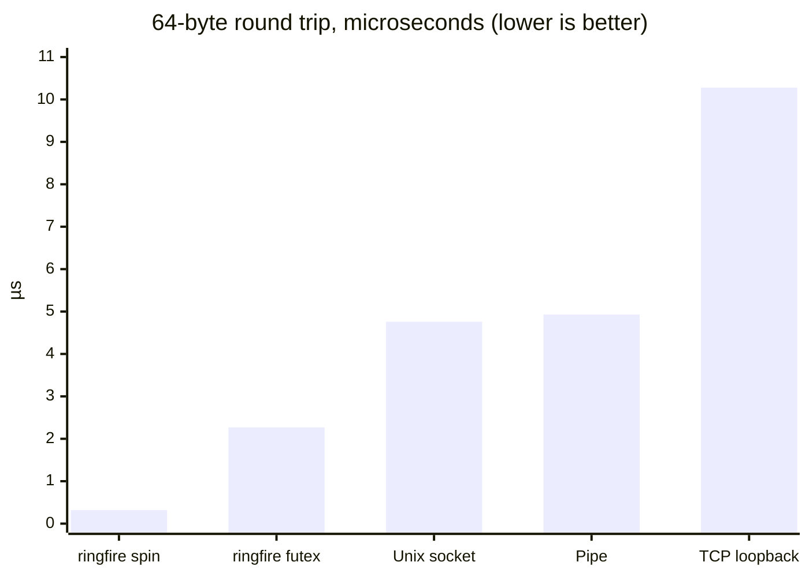
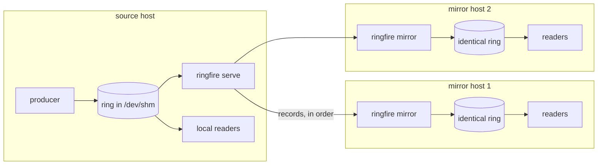
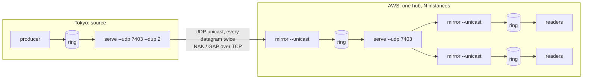

# ringfire 🔥

[](https://crates.io/crates/ringfire)
[](https://docs.rs/ringfire)
[](https://github.com/alex09x/ringfire/actions/workflows/ci.yml)
[](LICENSE-MIT)
[](https://www.rust-lang.org)

**`ringfire`** is an ultra-low-latency, zero-copy, lock-free **Inter-Process Communication (IPC)** ring buffer and shared memory state bus for Linux, and since v0.5.0 it mirrors a ring to other hosts with the same sequence numbers.

It is engineered for high-frequency trading (HFT) engines, real-time market data ingestion, telemetry buses, and performance-critical distributed pipelines where microsecond socket latencies and kernel overhead are unacceptable.

## ⚡ Performance at a Glance

**Round trip of a 64-byte message between two threads**, same machine, same harness
(`cargo bench --bench ipc_compare`, AMD Ryzen 9 7950X, Linux 6.8, v0.4.0):

| Transport | Round trip | vs. ringfire (spin) |
| :--- | ---: | ---: |
| **ringfire**, busy-spin readers | **0.32 µs** | 1× |
| **ringfire**, `FutexWait` (sleeps in the kernel when idle) | **2.27 µs** | 7× |
| Unix domain socket | 4.76 µs | 15× |
| Pipe | 4.93 µs | 15× |
| TCP loopback (`TCP_NODELAY`) | 10.28 µs | 32× |



**Hot-path costs** (`cargo bench --bench throughput`, 64-byte messages):

| Operation | Time | Rate |
| :--- | ---: | ---: |
| `push` (no reader attached) | 1.88 ns | 533 M msg/s |
| `try_recv` | 6.4 ns | 156 M msg/s |
| `recv_batch(32)` | 2.3 ns / msg | 431 M msg/s |
| `push` with a reader draining on another core | 41 ns | 24 M msg/s |
| Blackboard read / write (O(1) seqlock) | 2.1 / 1.1 ns | — |

The last `push` row is the realistic cross-process figure: it is bound by moving cache lines
between cores, and costs the same with lossless backpressure enabled (+0.8 ns). Every read is
validated against concurrent overwrites; the regression suite verifies zero torn records under
continuous lapping on x86-64 and AArch64. Full numbers: [Detailed Benchmarks](#-detailed-benchmarks-amd-ryzen-9-7950x-on-linux-booster).

**Network mirrors** (v0.5.0): the same ring, with the same sequence numbers, on other
hosts. Readers there attach to it as if it were local.

| Path, 64-byte records, 1,000 msg/s | push → read |
| :--- | ---: |
| consumer on the source host (same ring) | 0.1 µs |
| mirror on the same host, multicast | 3.8 µs |
| mirror on another host on a 1 GbE LAN, multicast, each of six | 30–32 µs |
| mirror in Los Angeles from a source in Tokyo, UDP unicast | 51.7 ms p50, **51.7 ms p99** |

Ordered, never duplicated, lost datagrams recovered from the ring itself; TCP, UDP
multicast or UDP unicast (works from behind NAT). See [Network Mirrors](#11-network-mirrors-one-source-ring-identical-copies-on-other-hosts)
and [docs/replication.md](docs/replication.md).

---

## 💡 The Problem: Why Traditional IPC Fails Under High Load

When communicating between processes on the same host, developers usually default to Unix Domain Sockets (UDS), TCP loopback, pipes, ZeroMQ, or broker-based message queues (NATS, Redis). In high-throughput, low-latency environments, these primitives introduce severe architectural bottlenecks:

| IPC Mechanism | Kernel Overhead | Memory Copies | One-way Latency | Backpressure / Crash Behavior |
| :--- | :--- | :--- | :--- | :--- |
| **Unix Domain Sockets (UDS)** | 2 syscalls (`send`/`recv`) + context switch | User $\to$ Kernel $\to$ User (2 copies) | ~2,400 ns measured (RTT / 2) | Socket buffer fills up; blocks producer or drops packets |
| **TCP Loopback (`127.0.0.1`)** | Full TCP/IP stack + packetization | Multiple copies + TCP buffers | ~5,100 ns measured (RTT / 2) | Heavy CPU jitter, flow control stalls |
| **Pipes / FIFOs** | Pipe inode lock + syscalls | Buffer copy through VFS | ~2,500 ns measured (RTT / 2) | Blocking write when pipe buffer (64 KB) fills |
| **Message Brokers (Redis / NATS)** | Network stack + daemon context switch | Multi-hop serialization | 50,000 – 500,000 ns (typical, not measured) | High GC/memory pressure, single point of failure |
| **`ringfire` (Shared Memory)** | **0 syscalls on hot path** | **1 copy (payload into the slot)** | **~160 ns one-way (measured)** | **Writer never blocks (lossy) or throttles on the slowest reader (lossless); crash-isolated** |

### The Three Critical Pain Points:
1. **The Syscall & Context Switch Tax**: Every `write()` and `read()` triggers CPU privilege elevation from user-space to kernel-space and back, polluting CPU L1/L2 caches and branch predictors.
2. **Buffer Bloat & Head-of-Line Blocking**: If a consumer process stalls (e.g. garbage collection pause in Python, disk IO hiccup, or debug pause), standard socket buffers fill up immediately, stalling the critical producer or blowing up memory.
3. **Serialization Overhead**: Marshalling data to and from JSON, Protobuf, or even compact binary encoders consumes valuable CPU cycles and allocates memory on the hot path.

---

## 🎯 The Solution & Vision: What `ringfire` Solves

`ringfire` moves the communication fabric directly into physical RAM via POSIX shared memory (`/dev/shm`):

- **Pure Shared Memory (`/dev/shm`)**: Producer and consumers map the exact same physical memory region directly into their virtual address spaces.
- **Atomic Acquire/Release Synchronization**: State is coordinated via 64-bit atomic sequence numbers using CPU-level memory barriers (`core::sync::atomic`), completely bypassing the operating system kernel.
- **Single-Writer Freedom (`LatestWins` Policy)**: The producer always writes to the ring. Slow, paused, or dead consumers can never block, stall, or crash the producer. If a consumer falls behind the ring buffer capacity, it detects that it was lapped and skips cleanly to the live stream.
- **Cache-Line Isolated Layout**: Memory structures are aligned to 128-byte cache lines to eliminate false sharing between producer write heads and consumer read heads.
- **O(1) State Blackboard**: Besides sequential stream events, `ringfire` provides a direct seqlock-synchronized slot table. Consumers can instantly inspect the latest state (e.g., current Best Bid & Offer for 500 coins) in ~2 nanoseconds without replaying historical events.
- **Polyglot First-Class Support**: Because the layout in `/dev/shm` is standard C-ABI memory, consumers can be written in Rust, C, C++, or Python (`mmap` + `ctypes`/`numpy`) with zero bridge penalty.

---

## 🤝 The Rapidfire Family

`ringfire` is designed as the cross-process counterpart to [**`rapidfire`**](https://github.com/alex09x/rapidfire):

```text
┌─────────────────────────────────────────────────────────────────────────────┐
│                          IN-PROCESS (Single Process)                        │
│                                                                             │
│                                  rapidfire                                  │
│           • Intra-process MPMC / MPSC channels across threads & Tokio       │
│           • Ultra-low latency (< 15 ns), zero heap allocations              │
└──────────────────────────────────────┬──────────────────────────────────────┘
                                       │
                                       ▼
┌─────────────────────────────────────────────────────────────────────────────┐
│                         CROSS-PROCESS (Multi-Process IPC)                   │
│                                                                             │
│                                  ringfire                                   │
│           • Inter-process lock-free ring buffer via /dev/shm                │
│           • O(1) Shared State Blackboard (Seqlock)                          │
│           • ~160 ns cross-core latency, C11 header, Python bindings         │
└──────────────────────────────────────┬──────────────────────────────────────┘
                                       │
                                       ▼
┌─────────────────────────────────────────────────────────────────────────────┐
│                          CROSS-HOST (Network Mirrors)                       │
│                                                                             │
│                           ringfire serve / mirror                           │
│           • The same ring, same sequence numbers, on other hosts            │
│           • TCP, UDP multicast, UDP unicast (NAT, clouds, other sites)      │
│           • ~30 µs across a LAN, no reordering, loss repaired from the ring │
└─────────────────────────────────────────────────────────────────────────────┘
```

---

## 🚀 Detailed Benchmarks (AMD Ryzen 9 7950X on Linux `booster`)

Benchmarked using Criterion directly against POSIX shared memory (`/dev/shm`) on host `booster` (16 Cores / 32 Threads, Linux 6.8):

Measured with protocol v2 (v0.4.0), 64-byte messages:

| Metric | Measured Value | Rate / Notes |
| :--- | :--- | :--- |
| **SPMC Single-Message Push** (no reader) | **1.88 ns** | 533 Million msgs / sec |
| **SPMC Non-Blocking `try_recv`** | **6.41 ns** | 156 Million msgs / sec |
| **SPMC Batch Drain (`recv_batch(32)`)** | **74.2 ns** (2.3 ns / msg) | 431 Million msgs / sec |
| **Push with a reader draining on another core** | **41.2 ns** lossy / **42.0 ns** lossless | Cross-core cache-line transfer; the lossless gate adds < 1 ns |
| **Roundtrip Latency (Ping-Pong RTT)** | **249.6 ns** | ~125 ns one-way cross-thread IPC |
| **Blackboard Seqlock Read (O(1))** | **2.13 ns** | Tear-free snapshot read |
| **Blackboard Seqlock Write (O(1))** | **1.13 ns** | Seqlock update |
| **Multi-Process Saturation** | **1 writer + 8 readers** | Zero gaps / zero corruption |

Single-threaded figures measure the instruction path with a warm cache; real cross-process
throughput is bounded by the cross-core transfer shown in the "with a reader" row.
`tests/regression_tests.rs` checks that no torn record is ever returned under continuous lapping.

---

## 📦 Quickstart (Rust)

All snippets below are compiled and run in CI as [`examples/quickstart.rs`](examples/quickstart.rs) (`cargo run --example quickstart`).

### 1. Producer: Publish Fixed-Size Binary Records

```rust
use ringfire::RingProducer;

#[repr(C)]
#[derive(Clone, Copy, Debug, PartialEq, Eq)]
struct MarketTicker {
    asset_id: u32,
    bid_px: u64,
    ask_px: u64,
    timestamp_ns: u64,
}

fn main() -> Result<(), Box<dyn std::error::Error>> {
    // Creates a 65,536 slot ring buffer in /dev/shm/hft_ticker_stream
    let mut producer = RingProducer::<MarketTicker>::create("/dev/shm/hft_ticker_stream", 65536)?;

    let ticker = MarketTicker {
        asset_id: 42,
        bid_px: 64_250_000_000,
        ask_px: 64_250_500_000,
        timestamp_ns: 1_726_870_000_000_000,
    };

    // Pushes ticker directly to shared memory (~2 ns)
    producer.push(&ticker);

    Ok(())
}
```

### 2. Tokio Async Consumer: Cooperative Non-Blocking Streaming

In async bots, busy loops starve the Tokio runtime. `AsyncRingConsumer` solves this with adaptive fast-path spinning, cooperative `tokio::task::yield_now()`, and 0% CPU idle sleep:

```rust
use ringfire::AsyncRingConsumer;

#[tokio::main]
async fn main() -> Result<(), Box<dyn std::error::Error>> {
    let mut consumer = AsyncRingConsumer::<MarketTicker>::attach("/dev/shm/hft_ticker_stream")?;

    println!("Attached async consumer. Streaming market data...");

    loop {
        // Yields cooperatively to other Tokio tasks when no traffic is present
        let ticker = consumer.recv().await;
        // Process ticker without stalling the Tokio runtime
    }
}
```

### 3. Synchronous Low-Latency Consumer (Dedicated Cores)

```rust
use ringfire::{RingConsumer, BusySpin};

let mut consumer = RingConsumer::<MarketTicker>::attach("/dev/shm/hft_ticker_stream")?;
let mut wait = BusySpin::new();

loop {
    // Spin polling for sub-20ns reaction time
    let ticker = consumer.recv_blocking(&mut wait);
    // Process ticker
}
```

### 4. Shared State Blackboard (O(1) Snapshot Table)

```rust
use ringfire::{BlackboardProducer, BlackboardConsumer};

// Producer updates snapshot table
let mut bb_prod = BlackboardProducer::<MarketTicker>::create("/dev/shm/hft_state_table", 1024)?;
bb_prod.write(42, &ticker)?; // ~1.1 ns write

// Consumer reads instantaneous current state by asset ID
let bb_cons = BlackboardConsumer::<MarketTicker>::attach("/dev/shm/hft_state_table")?;
if let Some(state) = bb_cons.read(42)? { // ~2.1 ns O(1) tear-free read
    println!("Current BBO for asset 42: bid={}, ask={}", state.bid_px, state.ask_px);
}
```

### 5. Raw Binary Payloads (`[u8; N]`) & Pointer Casting

You can also operate over raw byte buffers without declaring fixed structs:

```rust
use ringfire::{RingProducer, AsyncRingConsumer};

// Producer sends a raw 64-byte binary packet
let mut producer = RingProducer::<[u8; 64]>::create("/dev/shm/raw_stream", 65536)?;
let raw_bytes = [0xAAu8; 64];
producer.push(&raw_bytes);

// Consumer reads the 64 bytes and decodes the struct (byte arrays are not aligned for it)
let mut consumer = AsyncRingConsumer::<[u8; 64]>::attach("/dev/shm/raw_stream")?;
let bytes: [u8; 64] = consumer.recv().await;
let ticker: MarketTicker = unsafe { std::ptr::read_unaligned(bytes.as_ptr().cast()) };
```

### 6. Variable-Length Payloads (`BlobProducer` & `BlobConsumer`)

For variable-sized messages (e.g. L2/L3 order book snapshots, compressed frames, or variable trade batches), `ringfire` pairs fixed ring descriptors with a contiguous shared-memory `PayloadArena`:

```rust
use ringfire::{BlobProducerBuilder, BlobConsumer};

// Create a ring with 65,536 descriptor slots and a 16 MB byte arena
let mut producer = BlobProducerBuilder::new(65536, 16 * 1024 * 1024)
    .build::<u32, _>("/dev/shm/orderbook_stream")?;

// Push variable-length JSON, protobuf, or raw bytes directly into the arena
let raw_json = br#"{"event":"snapshot","bids":[[82000.5,1.2]],"asks":[[82001.0,0.8]]}"#;
producer.push(&42, raw_json)?;

// Consumer copies metadata + payload out of the arena, validated against overwrites
let mut consumer = BlobConsumer::<u32>::attach("/dev/shm/orderbook_stream")?;
let mut meta = 0u32;
let mut scratch_buffer = vec![0u8; 4096];
if let Some(len) = consumer.recv(&mut meta, &mut scratch_buffer)? {
    println!("Received {} byte snapshot for symbol {}", len, meta);
}

// Or inspect in place: the closure's result is discarded if the arena laps during it
let summary = consumer.view(|symbol, bytes| (*symbol, bytes.len()))?;
```

If the arena wraps around before a consumer gets to a message (payloads larger than
`arena_capacity / ring capacity` on average), that message is skipped and counted in
`lapped_count()`; size the arena for the backlog you need to retain.

### 7. Consumer Start Modes & Lock-Free SHM Checkpointing

Consumers can configure where in the stream to begin reading, and persist their read cursors lock-free into `/dev/shm` (a single atomic store plus a timestamp):

```rust
use ringfire::{RingConsumerBuilder, ConsumerStartMode};

let mut consumer = RingConsumerBuilder::<MarketTicker>::new()
    // Modes: Latest (instant jump), Head (wait for future), Oldest (replay backlog), Sequence(N)
    .start_mode(ConsumerStartMode::Latest)
    .attach("/dev/shm/hft_ticker_stream")?;

// Or attach with persistent offset checkpoint in /dev/shm:
let mut persistent_consumer = RingConsumerBuilder::<MarketTicker>::new()
    .offset_file("/dev/shm/hft_ticker_stream_worker1.offset")
    .attach("/dev/shm/hft_ticker_stream")?;

// In consumer loop, periodically or per-batch commit offset:
persistent_consumer.commit_offset()?;
```

### 8. Lossless Backpressure Flow Control

While default `ringfire` channels operate in `LatestWins` lossy mode (writer never blocks), streaming pipelines requiring zero message drops can enable `LosslessBackpressure`:

```rust
use ringfire::{RingProducerBuilder, FlowControl, RingfireError};

let mut producer = RingProducerBuilder::new(4096)
    .flow_control(FlowControl::LosslessBackpressure)
    .build::<MarketTicker, _>("/dev/shm/reliable_stream")?;

// Writer throttles (via spin/yield backoff) if slowest registered reader is about to be lapped:
producer.push(&ticker);

// Or use non-blocking try_push:
match producer.try_push(&ticker) {
    Ok(()) => println!("Pushed successfully"),
    Err(RingfireError::BackpressureBufferFull) => println!("Slow reader lag detected, backpressure applied"),
    Err(e) => return Err(e.into()),
}
```

What the guarantee covers:
- Only **Rust `RingConsumer`s registered in the ring's reader registry** hold the producer back
  (default 32 slots, `RingProducerBuilder::max_readers`). On a lossless ring, attaching when
  the registry is full fails with `NoAvailableReaderSlots`. Python and C readers do not
  register and can be lapped.
- A reader is protected from the moment the producer observes its registration (the
  producer rescans at least every half ring); a reader starting from `Oldest` on a busy
  ring can still find its first messages gone and reports them via `lapped_count()`.
- Reader liveness is checked by PID. Readers in another PID namespace (a different
  container) look dead to the producer and are dropped from the registry: share the PID
  namespace when using lossless mode across containers.
- The producer checks the registry only when it approaches the slowest cached cursor, so
  the lossless hot path has no syscalls and costs under 1 ns over lossy mode.

### 9. Multi-Channel Multiplexing (`RingMultiplexer` & `AsyncRingMultiplexer`)

Multiplex across multiple distinct ring buffer streams with fair Round-Robin or strict Priority scheduling:

```rust
use ringfire::{RingConsumer, RingMultiplexer};

let c1 = RingConsumer::<MarketTicker>::attach("/dev/shm/stream_btc")?;
let c2 = RingConsumer::<MarketTicker>::attach("/dev/shm/stream_eth")?;

let mut mux = RingMultiplexer::new();
mux.add(c1);
mux.add(c2);

// Fair Round-Robin across all channels
if let Some((channel_idx, ticker)) = mux.try_recv_any() {
    println!("Channel {} received ticker {}", channel_idx, ticker.asset_id);
}

// Or Tokio async multiplexing:
// let (idx, ticker) = async_mux.recv_any().await;
```

### 10. CLI Diagnostic & Monitoring Tool (`ringfire`)

The bundled `ringfire` binary provides real-time terminal monitoring and inspection:

```bash
# View buffer configuration, sequence counters, and registered consumer lag
cargo run --bin ringfire -- stat /dev/shm/hft_ticker_stream

# Machine-readable JSON output for automated telemetry:
cargo run --bin ringfire -- stat /dev/shm/hft_ticker_stream --json

# Real-time interactive terminal dashboard with msg/s and MB/s throughput:
cargo run --bin ringfire -- top /dev/shm/hft_ticker_stream --interval-ms 500

# Dump recent slots and payloads in hex or ASCII:
cargo run --bin ringfire -- dump /dev/shm/hft_ticker_stream --tail 10 --hex

# Clean up dead reader slots from crashed processes:
cargo run --bin ringfire -- prune /dev/shm/hft_ticker_stream
```

---

### 11. Network Mirrors: One Source Ring, Identical Copies on Other Hosts

One process writes a ring. Other hosts get a **mirror**: a ring with the same geometry
and the same sequence numbers, kept up to date over the network. Readers on a mirror host
attach to it with `RingConsumer` or `BlobConsumer` exactly as they would on the source
host and never touch the network. Records travel as raw slot bytes, so one
`ringfire serve` / `ringfire mirror` pair works for any element type, fixed-size or
variable-length (`BlobProducer` rings included). The full design, the story of what the
stress tests found and every measurement are in [docs/replication.md](docs/replication.md).



#### Choosing how records travel

| Route | Flag | Why |
| :--- | :--- | :--- |
| Processes on one host | none needed | they share the ring: 0.1 µs, no network |
| Your own LAN with your own switch | `--multicast GROUP:PORT` | one datagram whatever the number of mirrors; ~30 µs to every mirror, flat |
| Between sites, into a cloud, from behind NAT | `--udp PORT` on the source, `--unicast` on the mirror, `--dup 2` on long links | clouds and hosters do not route multicast; TCP pays a full round trip per lost segment, this path pays nothing |
| One mirror over a link that only passes TCP | default | simplest; a thread and a `write` per mirror on the source |

Whatever the transport: **records are written to a mirror strictly in sequence order,
never reordered, never duplicated**. A lost datagram is asked back with `NAK` over the
TCP control connection and answered from the source ring; the ring is the retransmission
buffer, so a mirror can be behind by up to `capacity` records (262,144 slots is 262 ms at
1 M msg/s, 26 s at 10 k msg/s). Only beyond that a mirror gets a `GAP` and its readers
see the same `lapped` count a slow reader on the source host would.

#### A site hub: cross the network once per site

A mirror is an ordinary ring, so a site runs one mirror over the WAN and serves it again
locally. One copy crosses the ocean however many readers the site has, and every hop
keeps the source's sequence numbers.



Measured through such a hub on the LAN: 52.9 µs p50 end to end against 10.3 µs for a
direct mirror, i.e. the hub costs its two network hops and nothing of its own. (VPCs have
no native multicast, only Transit Gateway multicast domains, so inside a cloud the hub
sends unicast to each instance: one `sendto` per instance per frame.)

#### CLI

```bash
# Source host, LAN with multicast
ringfire serve /dev/shm/ticks --bind 0.0.0.0:7400 --multicast 239.255.0.1:7401 --iface 10.0.0.5 --spin
# Mirror hosts on that LAN (join on the NIC facing the source)
ringfire mirror 10.0.0.5:7400 /dev/shm/ticks --iface 10.0.0.7 --spin

# Source host, mirrors anywhere (other sites, clouds, behind NAT)
ringfire serve /dev/shm/ticks --bind 0.0.0.0:7400 --udp 7403 --dup 2 --spin
ringfire mirror source.example:7400 /dev/shm/ticks --unicast --spin

# Site hub: mirror the source, then serve the mirror ring to local readers
ringfire mirror source.example:7400 /dev/shm/ticks --unicast --spin &
ringfire serve  /dev/shm/ticks --bind 0.0.0.0:7400 --udp 7403 --spin

# Resume after a restart from the last record in the local ring
ringfire mirror source.example:7400 /dev/shm/ticks --from resume --unicast
```

`serve` options: `--batch N` records per frame, `--linger-us N` (frame pacing, adaptive by
default), `--mtu N` datagram budget (8972 with jumbo frames on a LAN, ~1400 through a
tunnel), `--ttl`, `--iface`. `mirror` options: `--from latest|oldest|resume|N`, `--iface`,
`--once`, `--reconnect-ms`.

#### Rust

```rust
use ringfire::{Mirror, MirrorStart, MulticastConfig, ReplicaServer, RingConsumer};
use std::net::Ipv4Addr;

// Source host, LAN: one datagram for all mirrors.
let server = ReplicaServer::bind("/dev/shm/ticks", "0.0.0.0:7400")?
    .multicast(MulticastConfig::new(Ipv4Addr::new(239, 255, 0, 1), 7401).interface(source_nic))
    .spin(true);
server.spawn()?;

// Source host, mirrors anywhere: UDP unicast from port 7403, every datagram twice.
let server = ReplicaServer::bind("/dev/shm/ticks", "0.0.0.0:7400")?
    .unicast(7403, 1400)
    .duplicate(2)
    .spin(true);
server.spawn()?;

// Mirror host.
let mut mirror = Mirror::builder()
    .start(MirrorStart::Oldest)   // everything the source still retains, then live
    .unicast(true)                // ask for UDP unicast (ignored if the source has none)
    .spin(true)
    .connect("source.example:7400", "/dev/shm/ticks")?;
std::thread::spawn(move || mirror.run());

// Readers on the mirror host: the same code as on the source host.
let mut reader = RingConsumer::<Tick>::attach("/dev/shm/ticks")?;
while let Some(tick) = reader.try_recv() { /* ... */ }
```

`BlobProducer` rings need nothing extra: readers use `BlobConsumer` on the mirror, blobs
keep their bytes, length, flags and sequence, and only sit at a different offset in the
mirror's arena.

#### What it costs

64-byte records, one message every 100 µs unless noted, everything busy-polling, Linux
6.8, kernel network stack, two Ryzen 9 7950X hosts on a 1 GbE LAN.

| Stage | p50 | p99 |
| :--- | ---: | ---: |
| push → read by a consumer on the source (same ring) | 0.1 µs | 0.1 µs |
| push → read on a mirror on the same host, multicast | 3.8 µs | 4.9 µs |
| push → read on a mirror on the other host, multicast, each of six | 30–32 µs | 33–36 µs |
| push → read on a mirror on the other host, UDP unicast, each of six | 38–48 µs | 50–63 µs |
| push → read on a mirror on the other host, TCP | 31–34 µs | 35–38 µs |
| push → read on a leaf behind a hub, unicast both hops | 52.9 µs | 57.3 µs |

| Round trip, 20,000 samples | Transport | p50 | p99 | max |
| :--- | :--- | ---: | ---: | ---: |
| two hosts, one mirror each way | TCP | 54.0 µs | 59.1 µs | 1.3 ms |
| two hosts, one mirror each way | multicast | 53.1 µs | 59.9 µs | 86.9 µs |
| the same with 16 more mirrors on the second host | TCP | 53.5 µs | 235 µs | 11.0 ms |
| the same with 16 more mirrors on the second host | multicast | 63.7 µs | 72.1 µs | 84 µs |

| Sustained, open loop, 5 s per point | Transport, frame linger | Delivered | RTT p50 | RTT p99 |
| ---: | :--- | ---: | ---: | ---: |
| 1,000/s | multicast, adaptive | 100 % | 55 µs | 62 µs |
| 20,000/s | multicast, none | 100 % | 51 µs | 65 µs |
| 100,000/s | multicast, 100 µs | 100 % | 221 µs | 272 µs |
| 1,000,000/s | multicast, 300 µs | 100 % | 0.93 ms | 1.8 ms |

| Tokyo → Los Angeles, 100 ms ping, 1,000/s | one-way p50 | p99 | max |
| :--- | ---: | ---: | ---: |
| TCP | 50.4 ms | 99.6 ms | 132 ms |
| UDP unicast | 51.7 ms | 51.7 ms | 61 ms |
| UDP unicast, every datagram twice | 51.5 ms | 51.6 ms | 58 ms |

No record was lost or reordered at any point of any of these runs. Above ~20,000 msg/s
every unbatched record costs a datagram and a system call, and the kernel path here
sustains about 40,000 datagrams/s; frame pacing (`--linger-us`, adaptive by default:
frames leave at most once per 50 µs unless full) is what keeps 100,000/s at 221 µs
instead of over a millisecond. Near 1 M/s the 1500-byte MTU is the limit; jumbo frames
raise it six-fold. Going below the kernel stack means bypassing it (`AF_XDP`, DPDK,
Onload), which is the planned next transport.

#### Tuning checklist

* Give every mirror process two cores when it busy-polls (`--spin`): the mirror thread
  and the reader are both spinning; one core for both turns microseconds into scheduler
  slices of milliseconds.
* `--iface` on multi-homed hosts (docker bridges, several NICs); on Linux a socket bound
  to a port receives every multicast group joined on that port, so give each stream its
  own port.
* `--mtu 8972` once the NICs and the switch pass jumbo frames; `--mtu 1400` through
  WireGuard or other tunnels, never above the path MTU on a WAN.
* Size the source ring for the burst you want mirrors to survive: retention is
  `capacity` records.
* `--linger-us 0` for a steady stream near 20,000 msg/s where every microsecond counts;
  a fixed `--linger-us 100` for a steady 100,000 msg/s.

---

## 🛡️ Memory Safety: Why Raw Pointers into Shared Memory Are Dangerous

In cross-process shared memory with a non-blocking writer (`LatestWins`), returning a raw pointer (`*const T`) directly into the mapped `/dev/shm` buffer is **fundamentally unsafe**:
- If a consumer holds a raw pointer to slot $K$, and the writer laps the buffer and begins overwriting slot $K$ on another CPU core, the consumer will observe a **torn read** (half old data, half new data).
- In high-frequency trading and order book streaming, a torn read corrupts prices and sizes, leading to disastrous trading errors.

### The `ringfire` Solution: Slot Seqlock (protocol v2)
`ringfire` enforces tear-free reads without locks. The writer:
1. Stores `SLOT_WRITING` (`u64::MAX`) into the slot sequence, then a release fence.
2. Copies the payload.
3. Stores the message sequence with `Ordering::Release`.

The reader:
1. Loads the slot sequence $s_1$ with `Ordering::Acquire`; proceeds only if $s_1$ is the
   sequence it wants.
2. Copies the payload into its own stack/registers.
3. Issues an acquire fence and reloads the sequence $s_2$.
4. If $s_1 = s_2$, the copy is consistent. Otherwise the writer lapped the reader
   mid-copy: the copy is discarded and the reader jumps to the oldest retained message,
   counting the gap in `lapped_count()`.

Before v0.4.0 the writer skipped step 1, so a reader exactly one slot short of being
lapped could accept a half-overwritten payload; the regression suite now hammers this case.

> [!WARNING]
> **Anti-Pattern: Returning Raw Pointers into Shared Memory (`*const T`)**
> Some naive IPC designs attempt to return a direct pointer or slice `&[u8]` into `/dev/shm` to claim "zero-memcpy". In a multi-process architecture with a non-blocking writer (`LatestWins`), this is a dangerous anti-pattern: the writer can overwrite that memory slot at any microsecond while the reader is parsing it, causing undefined behavior, silent data races, and torn reads.
> 
> `ringfire` deliberately copies the slot payload into the reader's stack/register space inside a seqlock validation boundary (`s1 == s2`). For modern x86_64/ARM64 architectures, copying 32–64 bytes takes **~1 CPU clock cycle** (via `vmovups`) and is orders of magnitude faster than recovering from corrupted state or dealing with UB.


---

## ⚡ Wait Strategies

`ringfire` supports selectable wait strategies depending on CPU budget:

- **`BusySpin`**: Sub-30ns reaction time. Spins tightly on CPU (`core::hint::spin_loop()`). Recommended for dedicated HFT cores.
- **`YieldBackoff`**: Spins for $K$ iterations then calls `std::thread::yield_now()`. Balanced CPU usage with ~150ns reaction time.
- **`FutexWait`**: Sleeps on Linux `futex` when the queue is idle (timed sleep elsewhere). Near-0% CPU while waiting. The producer fast path has no full barrier, so a wake-up can rarely be missed; every sleep is therefore bounded (10 ms when no timeout is set).

---

## 🐍 Polyglot Access (C / C++ / Python)

- **C11 Header**: Include `include/ringfire.h` in any C/C++ project without linking overhead (header-only consumer), or link the `cdylib`/`staticlib` for the FFI producer, consumer and blackboard.
- **Python (`python/ringfire`)**: `RingConsumer`, `RingProducer`, `BlobConsumer` (zero-copy `try_recv` or validated `try_recv_copy`) and the blackboard, via `mmap` + `ctypes.Structure`.

All bindings speak **protocol v2** and locate slots through the header's `slots_offset`; v1 and
v2 peers refuse each other (`VersionMismatch`) instead of misreading memory. Python producers
rely on x86-64 store ordering (Python has no fences); use a Rust or C producer on AArch64.

## 📐 Delivery Semantics at a Glance

| Channel | Producer blocks? | Slow consumer | Delivery |
| :--- | :--- | :--- | :--- |
| `RingProducer` (default `LossyLatestWins`) | Never | Lapped: skips to the oldest retained message, `lapped_count()` | At-most-once per reader, in order |
| `RingProducer` + `LosslessBackpressure` | When the slowest registered reader is a full ring behind | Holds the producer | Exactly-once, in order, for registered Rust readers |
| `BlobProducer` / `BlobConsumer` | Never | Skips messages whose ring slot **or arena bytes** were overwritten | At-most-once per reader, in order |
| `MpmcProducer` / `MpmcQueueConsumer` | Never | Overrun items are dropped, `dropped_count()` | At-most-once, each item to one consumer |
| `BlackboardProducer` / `BlackboardConsumer` | Never | Always reads the latest value | Latest-value snapshot per key |

---

## 👥 Author

**Alexander Panasenko**
- Email: [alex@prod.codes](mailto:alex@prod.codes)
- GitHub: [@alex09x](https://github.com/alex09x)

---

## 📜 License

Licensed under either of:
- Apache License, Version 2.0 ([LICENSE-APACHE](LICENSE-APACHE))
- MIT License ([LICENSE-MIT](LICENSE-MIT))

at your option.
